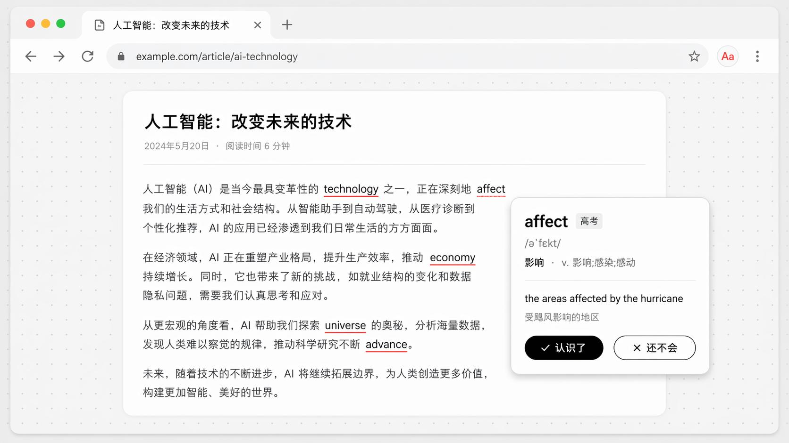

# NeoNeoEast · Foreign Language Learning Assistant



[中文](./README.md)

A zero-config Chrome extension that quietly replaces a **small number** of Chinese words with your target language (English **or** Japanese) as you browse Chinese web pages. Hover to reveal definitions, phonetics/POS, and example sentences — with a lightweight spaced-repetition loop inspired by Toucan.

> Install and go. No account, no network translation, no data upload — all dictionaries, example sentences, and learning records stay in your own browser.

## ✨ Features

- **Immersive Word Replacement**: While reading Chinese web pages, selected Chinese words are replaced with their foreign equivalents at a configurable interval — learn vocabulary naturally in context.
- **Accurate Chinese Word Segmentation**: Uses the browser's built-in `Intl.Segmenter` to split text along real word boundaries — no incorrect cuts.
- **English / Japanese, Mutually Exclusive**: Study one language at a time for focused learning.
  - English: Gaokao / CET-4 / CET-6 / Postgraduate Entrance / TOEFL / IELTS / GRE
  - Japanese: JLPT N5 / N4 / N3 / N2 / N1
- **Tiered Dictionary, Progressive Learning**: Select multiple proficiency levels; only words at chosen levels that you haven't yet mastered will be replaced.
- **Hover Cards**: Definitions, phonetics (English) / part-of-speech (Japanese), example sentences (native + Chinese translation), and quick "Skip / Save" buttons.
- **Spaced Repetition**: Words marked "Save" enter a review queue. Daily review with caps and rollover — no penalties, no forgetting curves.
- **Adjustable Density**: A slider controls roughly how many words appear per screen, spread evenly throughout the text.
- **Blacklist**: Disable replacement entirely on specific websites.
- **Export / Import**: CSV export (All / Mastered / Learning / Review) and full `.json` backup — switch computers in one click.

## 📦 Installation (Developer Mode)

1. Download this repository (click the green **Code → Download ZIP** button at the top right), then unzip.
2. Open Chrome and navigate to `chrome://extensions`.
3. Enable **Developer mode** (toggle in the top right).
4. Click **Load unpacked**, then select the unzipped folder.
5. Open any long Chinese article and refresh — you'll see the effect immediately. Click the extension icon in the toolbar to adjust language, levels, and density.

> Requires Chrome 87+ (for `Intl.Segmenter`). After changing settings, refresh the target page for them to take effect.

## 🗂️ Project Structure

```
NeoNeoEast/
├── manifest.json            # Extension manifest (Manifest V3)
├── background/              # Service worker: learning state machine, review scheduling, stats
├── content-script/          # Injected page logic: word replacement + hover card styles
├── popup/                   # Toolbar popup: toggle, language/level/density, review cards, 7-day trend
├── options/                 # Settings page: blacklist, review cadence, export/import, data overview
├── data/                    # Tiered dictionaries (dict-en.json / dict-ja.json)
└── icons/                   # Icons (16/32/48/128)
```

## 🔒 Privacy

This extension makes **no network requests and sends no data anywhere**. Dictionaries, example sentences, and translations are bundled locally with the extension. All learning records are stored in the browser's `chrome.storage.local`. Uninstalling removes everything. MIT license.

## 🛠️ Tech Stack

Vanilla JavaScript / HTML / CSS — zero build step, zero dependencies, zero network calls. Manifest V3, `Intl.Segmenter` for Chinese word segmentation, `chrome.storage.local` for all data persistence.

## 📄 License

[MIT](./LICENSE)
